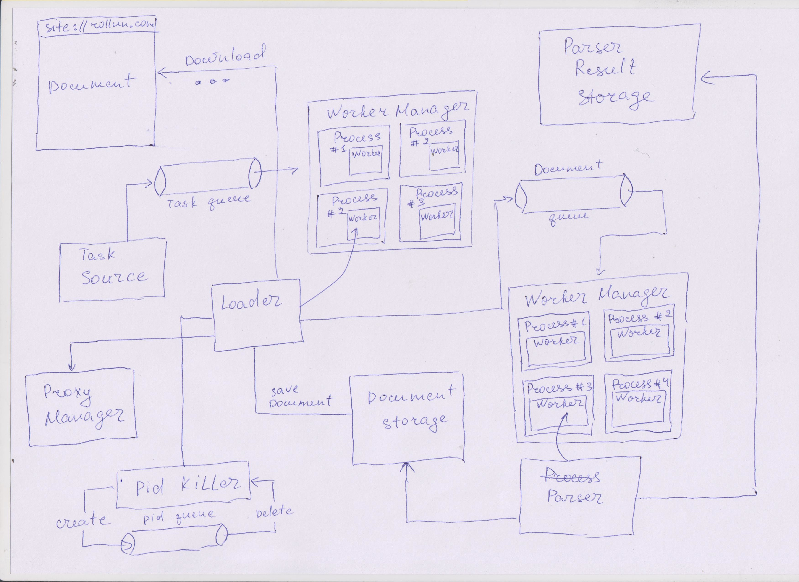

# rollun-parser

`rollun-parser` - библиотека, которая предоставляет базовые возможности для написание парсинга сайтов.
На основе какркаса данной библиотеки можно пострить вполне ефективную систему парсинга.

### Схема каркаса:



##### Основные компоненты:
- `Task source` - это модуль системы парсинга с которого все начинается. Задача этого модуля поставить в очередь для загрузчика
всю информацию, которая может быть понадобиться для того чтобы загрузить и обработать страницу. Зачастую это будут объекты,
которые после парсинга некой страницы хотят узнать больше информации о объекте парсинга.
- `Task queue` - это очередь, которая передает сообщения от `Task source` к `Loader`
- `Worker manager` - это объект, который управляет процессами, запущенными под руководством этим же объектом.
- `Process` - подробнее [тут](https://github.com/rollun-com/rollun-callback), єто единица управления для `Worker manager`.
Если процессу указать максимальное время жизни, то процессом будет теперь заботиться `Pid killer` и убьет процесс с истечением
указаного времени.
- `Worker` - это объект, который берет сообщение с очереди `Task queue` и запускает `Loader` с данными из очереди. Немаловажный
факт: если попытка загрузки страницы потерпела неудачи - `Worker` не будет удалять сообщение из очереди, таким образом, оно появиться
через некоторое время (`time-in-flight`) снова в очереди и буде отправлено на обработку `Loader` снова. Если загрузка прошла
успешно - сообщение будет удалено из очереди. В системе `Worker` есть частью `Process` и поэтому можно настраивать в 
- `Worker manager` какое макчимальное количество воркеров может работать одновременно.
- `Loader` - загружает страницу з сайта и валидирует ее с помощью указанных валидаторов. Если страница валидна, то она буде записана
в `Document storage`, а информация о ней записана в очередь `Document queue` для подальшего парсинга.
- `Parser` - подсистема `Worker manager` -> `Process` -> `Worker` -> `Parser` работает аналогично с `Worker manager` ->
`Process` -> `Worker` -> `Loader`. `Parser` после успешного парсинга страницы запишет данные в указанное хранилище
`Parser Result Storage`.
- `Proxy manager` - подсистема которая управляет выдачей прокси. Прокси выдаются всегда случайные, но частота зависит от
того насколько у прокси хорошая оценка и как давно он не был использован. Клиент который работает с прокси (в нашем случае это
`Loader`) должен вернуть фидбек про прокси (поставить эму оценку от 1 до 10). `Proxy manager` гарантирует что у него всегда найдутся
для тебя свеженькие прокси.
- `Parser Result Storage` - как уже было выше сказано, это хранилище, куда `Parser` сохраняет данные после парсинга.

##### Загрузчики

Библиотека предусматривает несколько базовых объектов для использования. Одним из таких есть `AbstractLoader`. Этот объект
предназначен для того чтобы загружать страницы з сайта, валидировать их, сохранять документы в персистентном хранилище
(в данном случае это файл) и записывать задание на парсинг в очередь. Для того чтобы написать свои загрузчики отнаследуйтесь
от этого объекта и реализуйте/переопределите методы если это требуется. В очередь передается сообщение в виде массива.
Под ключом `filepath` в этом массиве будет имя файла, где сохранился скачанный документ.

##### Парсера

Подобным объектом для парсинга есть `AbstractParser`. Обязаности этого объекта это распарсить файл, путь к которому указан 
в массиве (сообщение из очереди документов) и сохранить результат в соответствующие хранилище.

##### TaskResource

`TaskResource` - этот объект наследует `QueueFiller` из библиотеки
[rollun-com/rollun-callback](https://github.com/rollun-com/rollun-callback). Его задача взять нужные конфиги и создать
объект `ServerRequestInterface`, который будет описывать запрос для загрузчика.

Пример конфигов:
```php
[
    [
        'uri' => 'site://example.com',
        'method' => 'POST' // optional, default - 'GET'
    ]
]
```
